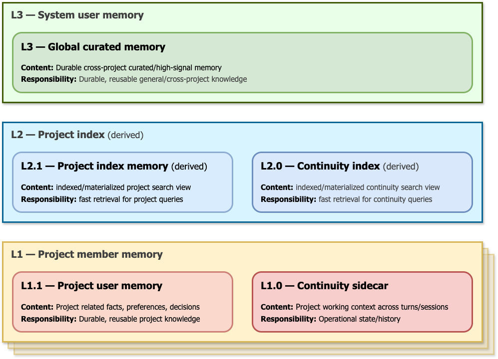

<p align="center">
  
</p>

# <div align="center" style="text-shadow: -1px -1px 1px #FFF, 1px 1px 1px #FFF;"><span style="color: #666;">Pi-</span>Muninn</div>


Pi Muninn is project memory for [`π`](https://github.com/mariozechner/pi): it helps your coding assistant remember useful project facts without making you repeat the same instructions in every chat.

This package is built with deep respect for MemPalace and the upstream `pi-mempalace` extension.

## The name

The package name combines `pi`, the host coding agent, with **Muninn** (pronounced “MOO-nin”), one of Odin's two ravens in Norse mythology. Huginn and Muninn are commonly associated with thought and memory; they are said to travel across the nine worlds and bring what they learn back to Odin. This package uses Muninn because its job is to help Pi carry useful project memory across sessions, users, and team members, then bring it back when it matters.

## Why this exists

Coding assistants are helpful, but they forget things when a chat gets long, resets, or is summarized. That creates real problems:

- you repeat the same project rules again and again,
- decisions get lost between sessions,
- personal preferences get mixed up with project-specific facts,
- teammates cannot easily share important project context,
- the assistant may search too much or not search at all,
- long chats send more text to the model than necessary.

That last point matters for cost. Most hosted AI providers charge based on tokens, which are small pieces of text sent to and returned by the model. Re-sending the same background information, long transcripts, or oversized search results can directly increase your bill. Even when using a local model, unnecessary text makes responses slower and uses more computer resources.

`@dev-vortex/pi-muninn` aims to reduce that waste. It keeps useful notes in the right place and gives the assistant a short, relevant briefing before it answers. When that short briefing is not enough, the assistant can do a focused lookup instead of dumping everything into the chat.

In simple terms: better memory should mean fewer repeated explanations, fewer wasted tokens, lower cost, and smoother long-running project work.

## Appreciation and lineage

This project is intentionally built on the shoulders of prior work.

### MemPalace

MemPalace helped popularize the idea that an assistant should have durable, searchable memory instead of relying only on the current chat window. That idea is valuable because important knowledge should survive beyond one conversation.

### `pi-mempalace`

Pi Muninn especially appreciates the upstream [`pi-mempalace`](https://github.com/Jabbslad/pi-mempalace) extension. The upstream project provides the original `pi` memory workflow, command inspiration, and compatible memory behavior that this package builds around.

This package keeps compatible global-memory behavior available and adds project-focused memory and handoff behavior around it. It should be understood as an extension of the `pi-mempalace` idea, not as an attempt to erase its authorship.

See `ACKNOWLEDGEMENTS.md` for upstream snapshot and license details.

## What this package does

`@dev-vortex/pi-muninn` adds one `pi` command root: `/memory`.

It helps with three kinds of information:

1. **Personal memory** — reusable preferences and facts about you.
   - Example: “I prefer TypeScript for web projects.”
2. **Project memory** — facts that only apply to the current repository.
   - Example: “This project uses Docker for validation.”
3. **Project handoff notes** — current work state, decisions, and next steps.
   - Example: “The README update is done; package smoke tests passed.”

The assistant can use these notes to avoid rediscovering the same information every time.

### Memory layers at a glance

<p align="center">
  
</p>

## How it works

### Short automatic briefings

Before the assistant answers, the extension can add a short memory briefing to the conversation. This briefing is intentionally limited so it does not flood the model with unnecessary text.

If the briefing already has enough information, the assistant can answer directly. If it may be incomplete, the assistant is told to perform one focused lookup.

### Local project storage

Project memory is stored inside the repository under:

```text
.agent/memory/
```

The important idea is simple:

- your project facts stay with the project,
- your personal reusable preferences stay in your personal memory,
- temporary handoff notes stay separate from durable facts,
- rebuildable search/cache files are not treated as the source of truth.

## Install

```bash
pi install npm:@dev-vortex/pi-muninn
```

Then open a project workspace and run:

```text
/memory project on
/memory project status
```

## Quick start

1. Check memory status:
   ```text
   /memory status
   ```
2. Enable project memory in the current repository:
   ```text
   /memory project on
   ```
3. Check who you are recorded as for project memory:
   ```text
   /memory project user status
   ```
4. Work normally. The assistant receives short project briefings automatically.
5. If project memory search looks stale, refresh it:
   ```text
   /memory project index rebuild
   ```

## Command reference

This README lists commands intended for normal package users. Maintainer-only and test-only controls are intentionally not documented here.

### Everyday commands

| Command | What it does |
|---|---|
| `/memory status` | Shows whether memory is available and whether project memory is active. |
| `/memory on` | Turns memory on. |
| `/memory off` | Turns memory off. |
| `/memory search <what you want to find>` | Searches saved memory. When project memory is active, project results are included. |
| `/memory stats` | Shows basic memory counts and status information. |

### Project memory commands

| Command | What it does |
|---|---|
| `/memory project` | Shows project-memory status and a short help summary. |
| `/memory project help` | Lists available public project commands. |
| `/memory project on` | Enables project memory for the current repository. |
| `/memory project off` | Disables project memory for the current repository. Existing files are kept. |
| `/memory project status` | Shows project memory health, storage, and handoff-note status. |
| `/memory project set <project name>` | Sets the project name used by memory. |
| `/memory project search <what you want to find>` | Searches only the current project memory. |

### User identity commands

Project memory is stored per user. This helps teammates share project context without overwriting each other.

| Command | What it does |
|---|---|
| `/memory project user status` | Shows which user identity is being used for project memory. |
| `/memory project user set <your name or email>` | Sets a stable identity for this project. Recommended when you plan to commit project memory files. |
| `/memory project user auto` | Returns to automatic identity detection. |

### Refresh and maintenance commands

| Command | What it does |
|---|---|
| `/memory project index status` | Shows whether the project search data looks healthy. |
| `/memory project index rebuild` | Rebuilds project search data from saved project memory. Use this if search results look stale. |

### Promotion commands

Promotion means copying a useful project lesson into your reusable personal memory when it is no longer only project-specific.

| Command | What it does |
|---|---|
| `/memory project promote status` | Shows whether there are reusable lessons ready to review. |
| `/memory project promote dry-run` | Previews what would be promoted without changing memory. |
| `/memory project promote run` | Applies accepted promotions into reusable personal memory. |
| `/memory project promote validate` | Checks promotion state and reports issues. |

### Other inherited memory commands

These commands come from the compatible memory workflow and are available for users who want deeper inspection.

| Command | What it does |
|---|---|
| `/memory rooms [project]` | Lists memory topics. |
| `/memory taxonomy` | Shows memory organized by project and topic. |
| `/memory graph` | Shows relationships between memory topics/projects. |
| `/memory knowledge <entity>` | Looks up saved facts about a person, tool, project, or other entity. |
| `/memory timeline [entity]` | Shows saved facts over time. |
| `/memory diary [query]` | Reads or searches diary-style notes. |

## What the assistant may do automatically

You usually do not need to type special tool names. During normal work, the assistant may:

- save a project-specific fact to project memory,
- save a reusable preference to personal memory,
- record a project handoff note when work changes direction,
- search memory when the automatic briefing says more evidence is needed.

A good rule of thumb:

- project decisions belong in project memory,
- reusable personal preferences belong in personal memory,
- current work status belongs in handoff notes.

## Git and storage safety

Project memory files live under:

```text
.agent/memory/
```

Common files:

| Path | Meaning | Commit guidance |
|---|---|---|
| `.agent/memory/<your-user-id>.db` | Your project memory and handoff notes. | Commit only when your identity is stable and your team intentionally shares project memory files. |
| `.agent/memory/<your-user-id>.db-wal` / `.db-shm` | SQLite helper files for the same database. | Follow the same rule as the matching `.db` file. |
| `.agent/memory/cache.db` | Rebuildable project search data. | Do not commit. |
| `.agent/memory/pi-muninn.config.json` | Local project memory settings. It can contain your user id. | Do not commit. If teammates share this file, they can accidentally write to the same DB file and create Git conflicts. |
| `.agent/memory/.gitignore` | Local safety rules generated by the extension. | Do not commit. It is meant to protect each local workspace. |

If you are unsure whether a memory file should be committed, stay inside Pi and run:

```text
/memory project user status
/memory project status
```

## Environment setting for identity

Most users do not need environment variables. If automatic identity detection is not enough, you can set:

| Variable | Purpose |
|---|---|
| `PI_MEMORY_USER_ID` | Forces the user identity seed used for project memory. |

## What to expect in daily use

- The assistant should remember important project facts more often.
- You should need to repeat fewer instructions.
- The assistant should use shorter relevant briefings instead of large memory dumps.
- Lower repeated context can reduce hosted model cost and improve response speed.
- If the assistant does not have enough evidence, it should perform a focused lookup.
- Rebuildable cache/search files should not become the source of truth.

## License

MIT. See `ACKNOWLEDGEMENTS.md` for upstream credit and vendored snapshot provenance.
